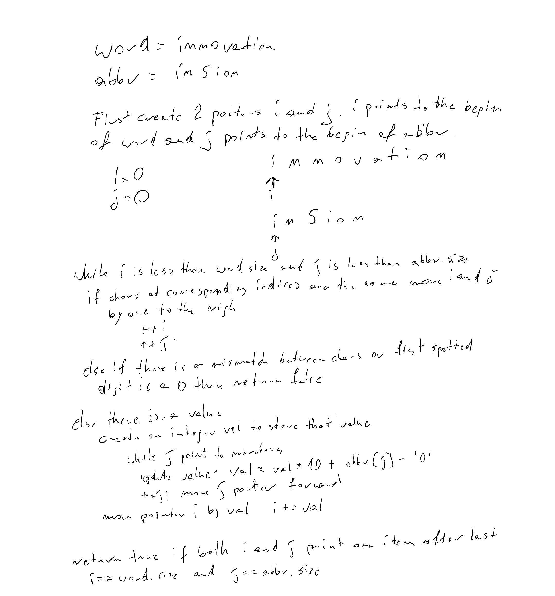

# Problem
Valid Word Abbreviation
## Description
Given a string, word, and abbreviation, abbr, return TRUE if the abbreviation matches the given string. Otherwise, return FALSE. An abbreviation can replace any non-adjacent, non-empty substrings of the original word with their lengths. Replacement lengths must not contain leading zeros.
## Key Observations
Check if value in abbreviation corresponds to number of ommited characters.
## Approaches Considered
Two pointers both of the beginning of the corresponding strings.
## Final Solution
Set two pointers i, j both at index 0
while i is less than word.size() and j is less than abbr.size()
    if chars at corresponding indices are the same 
        move forward i and j by one
    else if char at index j is different that char at index i or first number at index j is equal to 0 
        return false
    else there is a correct number in abbr
        create an integer val to store that value
        while until j points to number
            update val by next number by given formula val = val * 10 + abbr[j] - '0'
            move j forward by one
        update i pointer by val from abbr
return true only if i and j points one item after last item in corresponding string
## Complexity Analysis
- Time Complexity: O(n) - single pass
- Space Complexity: O(1) - no extra memory is used

## Example Test Cases
"calendar", "cal3ar"
"calendar", "c6r"
"calendar", "c06r"
"calendar", "cale0ndar"
"calendar", "c24r"
## Edge Cases
abbr starts or ends with a number
## Additional Notes / Improvements
STL provides great tools:
std::isalpha(char) checking if given char is a letter
std::isdigit(char) checking if given char is a digit

## Whiteboard solution
