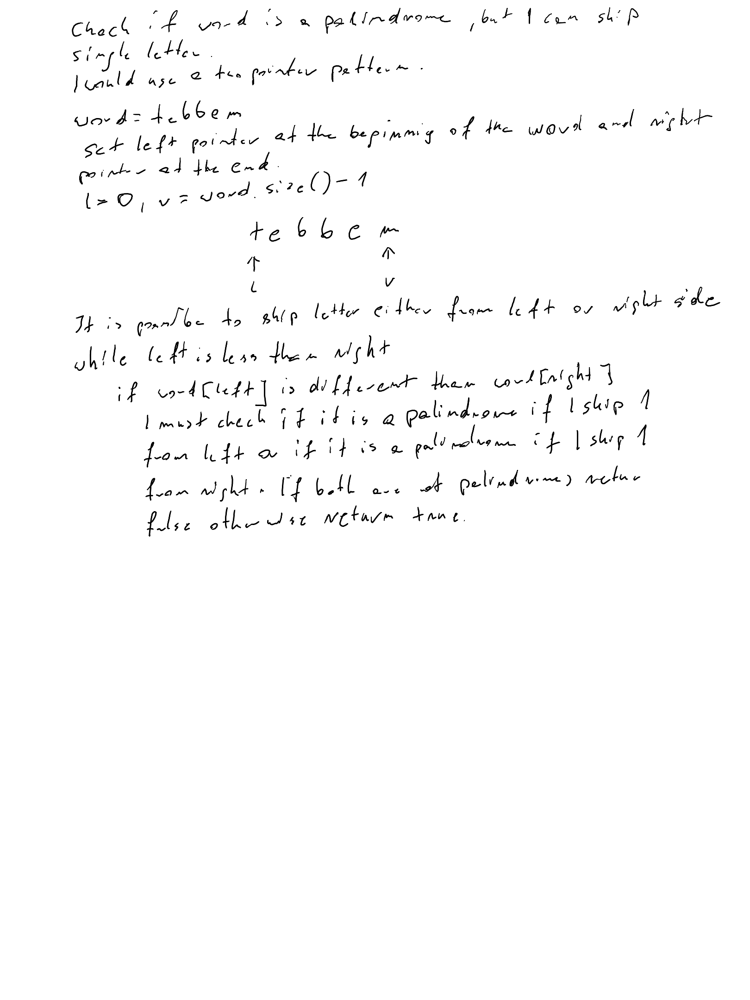

# Problem
Valid Palindrome II
## Description
Write a function that takes a string as input and checks whether it can be a valid palindrome 
by removing at most one character from it.
## Key Observations
It is possible to have a valid palindrome if I skip either one letter from the left side or one from the right
## Approaches Considered
Two pointers left at the begin of the given string and right at th end.
## Final Solution
Set two pointers left = 0 and right = string.size() - 1
while left pointer is less than right
    if char at left pointer is different than char at index right
        check if it is a palindrome after skipping one letter from the left
        or if it is a plalindorme after skipping one letter from the right
        in both are not a palindorme return false
    update both pointers ++left, --right
if while finished wihout return it means the given word is a palindrome, so return true
## Complexity Analysis
- Time Complexity: O(n) - single pass
- Space Complexity: O(1) - no extra memory is used

## Example Test Cases
- "aba"  
- "abca" 
- "abc"    
- "deeee" 
- "a" 
## Edge Cases

## Additional Notes / Improvements
Create helper function without copying the original string
to keep space complexity as O(1)

## Whiteboard solution
