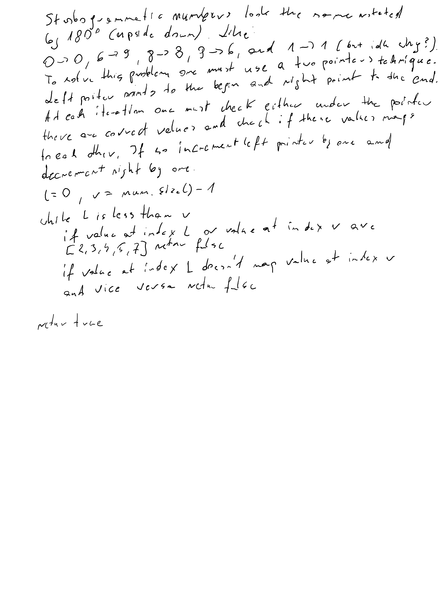

# Problem
Strobogrammatic Number
## Description
Given a string num representing an integer, determine whether it is a strobogrammatic number. 
Return TRUE if the number is strobogrammatic or FALSE if it is not.
A strobogrammatic number appears the same when rotated 180 degrees (viewed upside down).
## Key Observations
Check if given number contains only strobogrammatic digits and if they map correctly
## Approaches Considered
Two pointers left at the begin of the given string and right at the end.
## Final Solution
Set two pointers left = 0 and right = string.size() - 1
while left pointer is less than right
    if num contains value that is not strobogrammatic [2,3,4,5,7] return false
    if digit at left pointer doesn't map [0->0, 1->1, 6->9, 8->8, 9->6] to digit at right pointer return false
if while finished wihout return it means the given number is strobogrammatic, so return true
## Complexity Analysis
- Time Complexity: O(n) - single pass
- Space Complexity: O(1) - no extra memory is used

## Example Test Cases
- "69"  -> true
- "88"  -> true
- "818" -> true
- "962" -> false
## Edge Cases
Single value, like 8, 6, 1
## Additional Notes / Improvements
1 is a strobogrammatic digit

## Whiteboard solution
